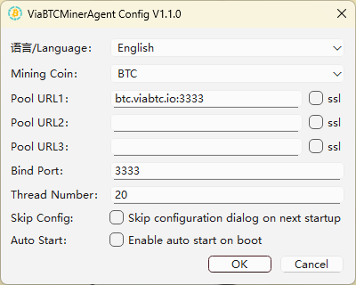
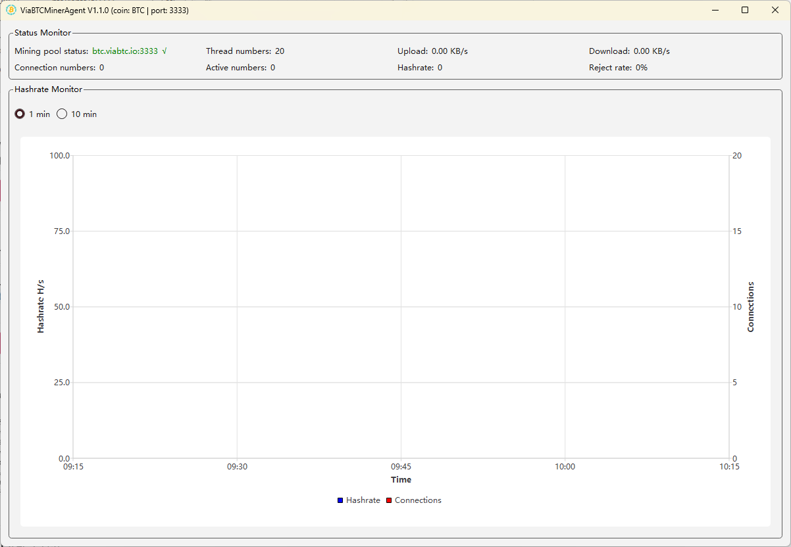
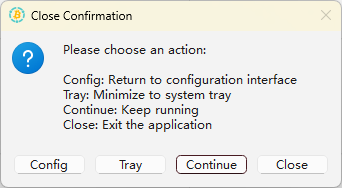
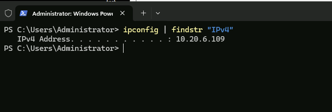

# Windows MinerAgent User Guide

English | [简体中文](./README.md) | [Русский](./README.ru.md)

## System Requirements
- Operating System: 64-bit Windows 10 or higher
- Processor: 4 cores or more
- Memory: 8 GB RAM or more
- Storage: 60 GB or more
  
## Deployment Steps
### 1. Download MinerAgent
Link: https://github.com/viabtc/mineragent/tree/master/windows 

### 2. Configure MinerAgent
After opening `viabtc_mineragent_gui.exe`, you’ll see the configuration interface as shown
below:

**Field Descriptions:**
- Mining Coin: Default is BTC. Select other coins from the dropdown menu
- Pool URL 1-3: You can configure 3 mining addresses. If the current address fails to connect, it will automatically switch to the next one.
- ssl: Whether the Pool URL is SSL-encrypted
- Bind Port: The port miners use to connect to the agent. Default is 3333 (If you want to run multiple agents, the bind port cannot be the same)
- Thread Number: The number of worker threads used by the agent. Default is the number of CPU threads on the local machine. (No modification needed.)
- Skip Config: If enabled, the application will skip the configuration step on the next launch and start the agent service using your previous settings.
- Auto Start: If enabled, the agent service will launch automatically at system startup. Enabling this option also automatically enables “Skip Config.”

### 3. Start MinerAgent
Click `OK` to launch the agent after configuration, as shown below:

**Interface Overview**  

Status Monitor:
- Mining pool status: The agent’s connection status to the mining pool. Green means connected; red means failed
- Thread numbers: Number of threads currently running. This can be configured in the configuration interface.
- Upload: Current upload speed of the agent
- Download: Current download speed of the agent
- Connection numbers: Number of miners currently connected to the agent
- Active numbers: Number of connected miners that have submitted hashrate within 10 minutes.
- Real-Time Hashrate: Total hashrate submitted by all connected miners, calculated every 10 minutes.
- Reject rate: The percentage of rejected or invalid shares
  
Hashrate Monitor:
- 1 min / 10 min Buttons: Switch the hashrate monitoring interval
- Line Chart: Blue line shows hashrate trends; green line shows the number of connected miners.
- Hover over the chart to view detailed data on hashrate and connections

### 4. Exit Options
Click X in the upper-right corner of the agent service interface to open the Close Confirmation dialog.

Button Descriptions:
- Config: Close the current agent service window and return to the configuration interface.
- Tray: Minimize the agent service program to the system tray in the lower-right corner of your desktop.
- Continue: Cancel the action and return to the agent service interface.
- Close: Exit the agent service program.

### 5. Miner Connection
Miners should connect to the agent via `IP:Port`.  
IP is the `Server IP` where the agent is running. Port is the `Bind Port` configured in the configuration page.

How to check `Server IP`:

Press `Win + r`, type `cmd` or `powershell`, and press Enter to open the command prompt. Type `ipconfig | findstr "IPv4"` and press Enter. You’ll see the `Server IP`.

Example: the server IP is `10.20.6.109` and the bind port is `3333`, then on the miner
configuration interface, set the mining URL as: `stratum+tcp://10.20.6.109:3333`.

### 6. Additional Notes
- To prevent internal IP address changes, it is recommended to set a static IP. You can find guides online for setting a static IP in Windows.
- Use only one agent per mining coin. For multiple coins, run a separate agent for each.