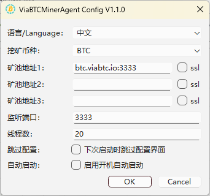
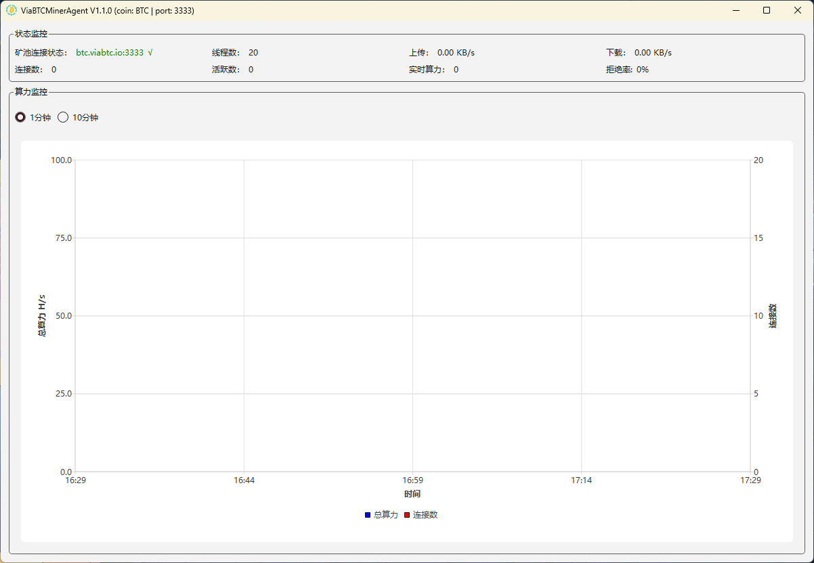
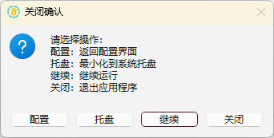

# Windows版本代理服务使用文档

简体中文 | [English](./README.en.md) | [Русский](./README.ru.md)

## 配置要求
- 操作系统：64位 Windows 10 或以上系统
- 处理器：4核 或以上
- 内存：8G RAM 或以上
- 存储空间：60GB 或以上
  
## 部署步骤
### 1. 下载 MinerAgent
下载地址：https://github.com/viabtc/mineragent/tree/master/windows 

### 2. 配置 MinerAgent
打开 `viabtc_mineragent_gui.exe` 后，即可进入配置页面，配置界面如下图：

**字段说明**
- 矿池地址1~3：可配置3个挖矿地址，如果当前地址连接失败，自动切换到下一个地址
- 挖矿币种：默认为BTC，可下拉选择其它币种
- ssl复选框：矿池地址是否为ssl加密地址
- 监听端口：矿机连接代理服务的端口，默认为3333（若需要开启多个代理服务，则监听端口不能重复）
- 线程数：代理服务启动的工作线程数，默认为本机cpu的线程数量（无需修改）
- 跳过配置：勾选后，下次打开程序将跳过配置阶段，将会使用上次的配置进入代理服务界面
- 自动启动：勾选后，将设置为开机自动启动代理服务，勾选该项后，跳过配置将会自动勾选上

### 3. 启动 MinerAgent
配置完成后，点击 `OK` 按钮，即可启动代理服务，启动后如下图：

**界面说明**  

状态监控栏：
- 矿池连接状态：当前代理服务连接的矿池连接状态，绿色为与矿池连接成功，红色为与矿池连接失败
- 线程数：当前代理服务启动的工作线程数，在配置界面可进行配置
- 上传：当前代理服务上传速度
- 下载：当前代理服务下载速度
- 连接数：当前代理服务连接的矿机数量
- 活跃数：当前代理服务连接的矿机中，10分钟之内有提交算力的矿机数量
- 实时算力：当前代理服务连接的矿机提交的算力总和（十分钟统计一次）
- 拒绝率：被拒绝或判定无效的share所占的比例
  
算力监控栏：
- 1分钟、10分钟按钮：切换算力监控的时间间隔
- 算力、连接数统计折线图：蓝色线为算力统计，绿色线为连接数统计
- 可将鼠标移动到折线图上，查看具体的算力、连接数

### 4. 退出选项
在代理服务界面点击右上角的 `X` 后，将弹出关闭确认界面

按钮说明：
- 配置：点击后，将关闭当前代理服务界面，返回配置界面
- 托盘：点击后，将代理服务程序最小到系统右下角的托盘内
- 继续：点击后，将不做任何操作，返回代理服务界面
- 关闭：点击后，将退出关闭代理服务程序

### 5. 矿机连接
矿机需要通过 `IP:端口` 连接代理服务。  
IP为代理服务所在的 `服务器IP` ，端口为代理服务配置界面中配置的 `监听端口`。  
查看 `服务器IP` 的方法：  
首先 `win + r` 打开运行窗口，输入 `cmd` 或者 `powershell` 后按回车，打开命令行窗口，输入 `ipconfig | findstr "IPv4"` 回车，即可查看 `服务器IP`。

本例子中，服务器IP为 `10.20.6.109`，配置的监听端口为 `3333`，那么在矿机配置界面，配置挖矿地址： `stratum+tcp://10.20.6.109:3333`。

### 6. 其他
- 为了防止服务器内网IP动态变化，可设置为静态IP地址，设置静态IP地址的方法可上网搜索Windows系统如何设置静态IP 。
- 一个挖矿币种只需启动一个代理服务程序，多个币种挖矿相应的启动多个币种的代理服务程序